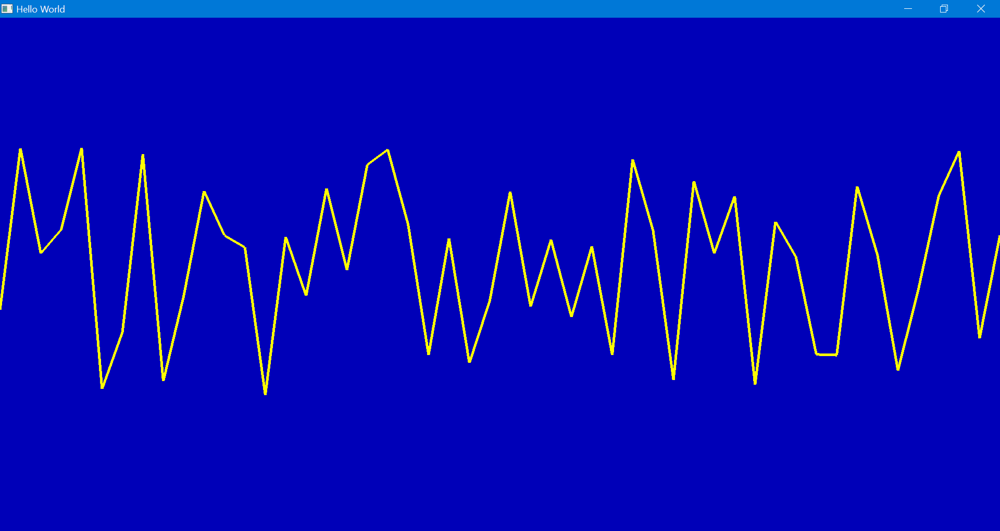

# Example moderngl + glfw

## Screenshot


## Run

```sh
poetry install

poe start
```

Use <kbd>Enter</kbd> to refresh the graph.  
Use <kbd>Arrow Left</kbd> and <kbd>Arrow Right</kbd> to pan the graph.  


